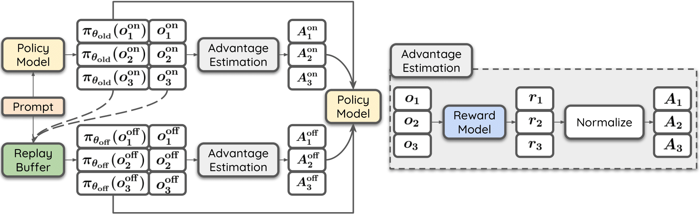

<h3 align="center"><a href="https://arxiv.org/pdf/2411.08147">
RePO: Replay-Enhanced Policy Optimization</a></h3>


<p align="center">
  <a href="https://arxiv.org/pdf/2411.08147">
    
  </a>
  <a href="https://huggingface.co/collections/Siheng99/repo-6842917aa0de58f74c52f79c">
    
  </a>
</p>


<p align="center">
    
</p>

## 🛠️ Setup
**Basic Dependencies**:
* Python == 3.12.9
* Pytorch == 2.6.0
* CUDA Version == 12.4

**Install required packages**:
```bash
git clone https://github.com/SihengLi99/RePO.git
pip install -r requirements.txt
```

**Execution Without SLURM**

Although SLURM job scripts are provided for both training and evaluation, users operating outside a SLURM environment may adapt the scripts by commenting out SLURM-specific directives and executing the core commands directly via bash.

## 📊 Evaluation
```bash
python src/build_math_benchmarks.py

sbatch scripts/evaluate_math.slurm
```
Note: Set MODEL_NAME_OR_PATH to the desired target model.

## 🔥 Training

```bash
python src/build_training_dataset.py

sbatch scripts/train_replay_grpo.slurm
```

## 📑 Citation

If RePO is useful for your research or applications, please cite it with the following BibTeX:
```bibtex
@article{li2024large,
  title={Large Language Models Can Self-Improve in Long-context Reasoning},
  author={Li, Siheng and Yang, Cheng and Cheng, Zesen and Liu, Lemao and Yu, Mo and Yang, Yujiu and Lam, Wai},
  journal={arXiv preprint arXiv:2411.08147},
  year={2024}
}
```